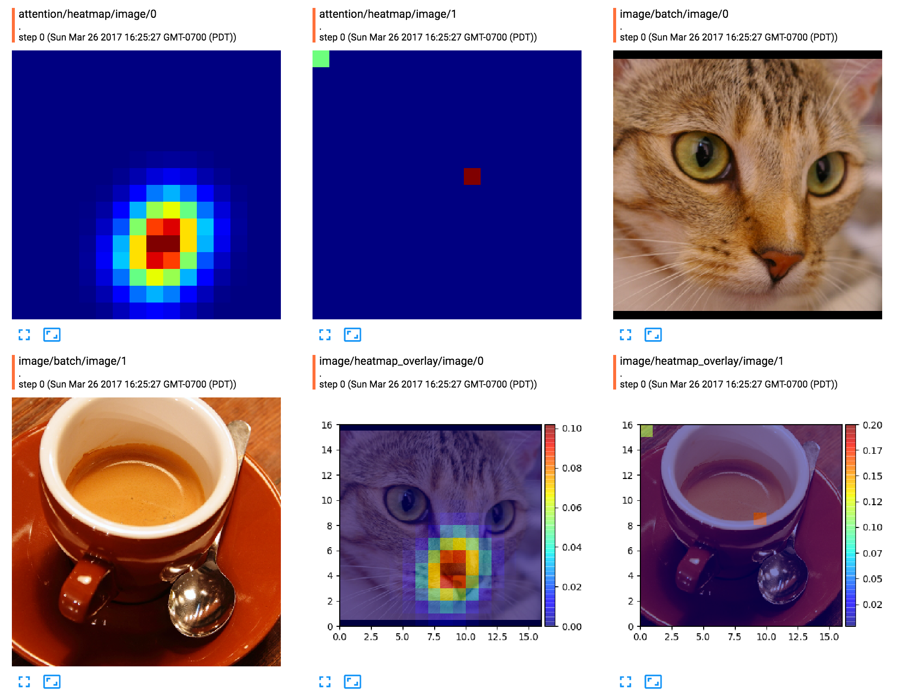

TensorFlow Plot
===============

[][pypi_tfplot]
[][documentation]
[](https://travis-ci.org/wookayin/tensorflow-plot)

A [TensorFlow][tensorflow] utility for providing matplotlib-based **plot** operations
— [TensorBoard][tensorboard] ❤️ [Matplotlib][matplotlib].

<p align="center">
<i> 🚧 Under Construction —  API might change!</i>
</p>

It allows us to draw **_any_** [matplotlib][matplotlib] plots or figures into images,
as a part of TensorFlow computation graph.
Especially, we can easily any plot and see the result image
as an image summary in [TensorBoard][tensorboard].

<p align="center">

</p>

Quick Overview
--------------

We can wrap *any* pre-existing functions for plotting, e.g.,
[`seaborn.heatmap`](http://seaborn.pydata.org/generated/seaborn.heatmap.html) or [matplotlib `Axes`](https://matplotlib.org/api/axes_api.html),
as a Tensorflow op:

```python tfplot
import tfplot
import seaborn.apionly as sns

tf_heatmap = tfplot.wrap_axesplot(sns.heatmap, figsize=(4, 4), batch=True)
tf.summary.image("attention_maps", tf_heatmap(attention_maps))
```

Alternatively, if you need more flexibility on plots,
just define a python function that takes `numpy.ndarray` values as input,
draw a plot, and return it as a `matplotlib.figure.Figure` object.
Then, `tfplot.plot()` will wrap this function as a TensorFlow operation,
which will produce a RGB-A image tensor `[height, width, 4]` containing the resulting plot.

```python
def figure_heatmap(heatmap, cmap='jet'):
    # draw a heatmap with a colorbar
    fig, ax = tfplot.subplots(figsize=(4, 3))
    im = ax.imshow(heatmap, cmap=cmap)
    fig.colorbar(im)
    return fig

# heatmap_tensor : a float32 Tensor of shape [16, 16], for example
plot_op = tfplot.plot(figure_heatmap, [heatmap_tensor], cmap='jet')

# Or just directly add an image summary with the plot
tfplot.summary.plot("heatmap_summary", figure_heatmap, [heatmap_tensor])
```

Please take a look at the
[the showcase][examples-showcase] or [examples directory][examples-dir]
for more examples and use cases.

[The full documentation][documentation] including API docs, can be found at [readthedocs][documentation].


Installation
------------

```
pip install tensorflow-plot
```

To grab the latest development version:

```
pip install git+https://github.com/wookayin/tensorflow-plot.git@master
```

Note
----

### Some comments

Matplotlib operations can be *very* slow as Matplotlib runs in python, so please be aware of runtime performance.
There is still a room for improvement, which will be added sometimes later.

Moreover, it might be also a good idea to draw plots from the main code (rather than having a TF op) and add them as image summaries.
Please use this library with your best discernment.

### Thread-safety issue

Please use **object-oriented** matplotlib APIs (e.g. `Figure`, `AxesSubplot`)
instead of [pyplot] APIs (i.e. `matplotlib.pyplot` or `plt.XXX()`)
when creating and drawing plots.
This is because [pyplot] APIs are not *thread-safe*,
while the TensorFlow plot operations are usually executed in multi-threaded manners.

For example, avoid any use of `pyplot` (or `plt`):

```python
# DON'T DO LIKE THIS !!!
def figure_heatmap(heatmap):
    fig = plt.figure()
    plt.imshow(heatmap)
    return fig
```

and do it like:

```python
def figure_heatmap(heatmap):
    fig = matplotlib.figure.Figure()   # or just `fig = tfplot.Figure()`
    ax = fig.add_subplot(1, 1, 1)      # ax: AxesSubplot
    # or, just `fig, ax = tfplot.subplots()`
    ax.imshow(heatmap)
    return fig                         # fig: Figure
```

For example, `tfplot.subplots()` is a good replacement for `plt.subplots()`
to use inside plot functions.


[pypi_tfplot]: https://pypi.python.org/pypi/tfplot
[matplotlib]: http://matplotlib.org/
[tensorflow]: https://www.tensorflow.org/
[tensorboard]: https://www.tensorflow.org/get_started/summaries_and_tensorboard
[pyplot]: http://matplotlib.org/api/pyplot_api.html
[examples-dir]: https://github.com/wookayin/tensorflow-plot/blob/master/examples/
[examples-showcase]: https://github.com/wookayin/tensorflow-plot/blob/master/examples/showcases.ipynb
[documentation]: http://tensorflow-plot.readthedocs.io/en/latest/


License
-------

[MIT License](LICENSE) © Jongwook Choi
